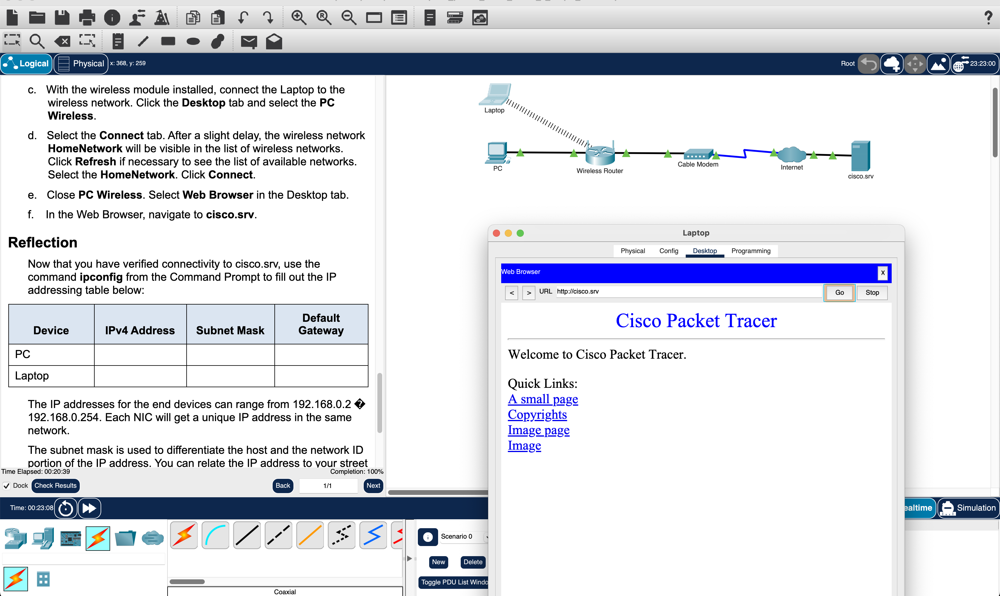
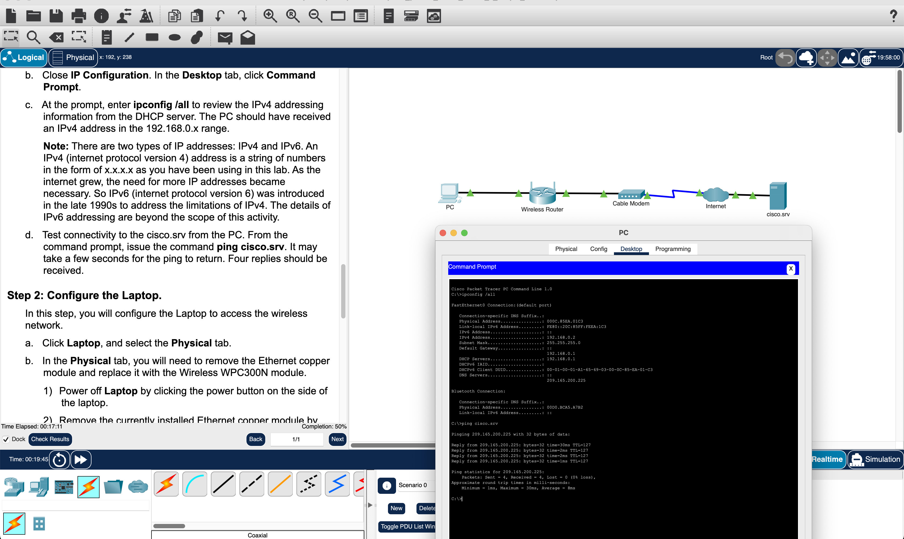

# Cisco Packet Tracer - Create a Simple Network

This project involves creating and configuring a simple network in Cisco Packet Tracer. I followed the steps systematically, connecting various end devices and configuring them to ensure proper connectivity. The exercise enhanced my understanding of basic network setup, device configuration, and connectivity verification in both wired and wireless environments. Below is a detailed explanation of the exercise, lessons learned, and the skills gained.

## Objectives

- **Part 1**: Build a Simple Network
- **Part 2**: Configure the End Devices and Verify Connectivity

---

## Part 1: Build a Simple Network

### Step 1: Add Network Devices to the Workspace

The first task involved adding a PC, laptop, and a cable modem to the Logical Workspace in Packet Tracer. This setup simulates a small home or office network, allowing for both wired and wireless connections.

**Skills Gained**:

- Understanding different network devices such as PCs, laptops, and cable modems.
- Familiarity with the Logical Workspace in Packet Tracer.

### Step 2: Change Display Names of Network Devices

After adding the devices, I renamed them for clarity: `PC`, `Laptop`, and `Cable Modem`.

**Skills Gained**:

- Ability to modify device settings and change display names in Packet Tracer for better organization.

### Step 3: Add Physical Cabling

In this step, I connected the devices using appropriate cables:

- A **copper straight-through cable** was used to connect the PC to the wireless router.
- The wireless router was connected to the cable modem using another **copper straight-through cable**.
- A **coaxial cable** was used to connect the cable modem to the internet cloud.

**Skills Gained**:

- Differentiating between cable types (copper straight-through and coaxial) and understanding their use in real-world networks.
- Learning how to physically connect devices in a network.

---

## Part 2: Configure the End Devices and Verify Connectivity

### Step 1: Configure the PC

The PC was connected to the network via an Ethernet cable. I enabled **DHCP (Dynamic Host Configuration Protocol)**, which allowed the PC to automatically receive an IP address from the router.

**Lessons Learned**:

- **DHCP** automates IP address assignment, saving time in network configuration and management.
- Learned how to verify IP configuration using `ipconfig /all` and test network connectivity using the `ping` command.

### Step 2: Configure the Laptop

For the laptop, I replaced the wired network interface card (NIC) with a **wireless NIC**. This allowed the laptop to connect to the wireless router. Once connected, I verified internet connectivity by navigating to `cisco.srv`.

**Skills Gained**:

- Configuring wireless devices and replacing NICs in Packet Tracer.
- Connecting a device to a wireless network and verifying its connectivity.

## Reflection and Real-World Application

This exercise provided a hands-on introduction to basic networking concepts, including device configuration, cabling, IP address assignment, and connectivity verification. The steps closely mirror real-world networking tasks, such as setting up home or office networks where a mix of wired and wireless devices need to connect to the internet via a router and modem.

### Lessons Learned:

1. **Network Design**: Understanding the flow of data and how different devices (PC, laptop, router, modem) communicate to form a functional network.
2. **DHCP**: Automated IP configuration is crucial in reducing manual errors, making it easier to manage multiple devices.
3. **IP Addressing**: The concept of subnet masks, default gateways, and how IP addressing works in different networks.
4. **Device Configuration**: Learning how to configure both wired and wireless devices for network access.

### Real-World Application:

The skills gained in this exercise can be directly applied in real-world scenarios, such as:

- Setting up home networks, ensuring both wired and wireless devices are properly configured.
- Troubleshooting network issues, particularly related to IP addressing and connectivity.
- Using DHCP to simplify network management in small to medium-sized businesses.

## Conclusion

This exercise offered practical experience in building, configuring, and managing a basic network using Cisco Packet Tracer. The lessons learned, from connecting devices to verifying their configuration, are fundamental skills for anyone pursuing a career in networking.
